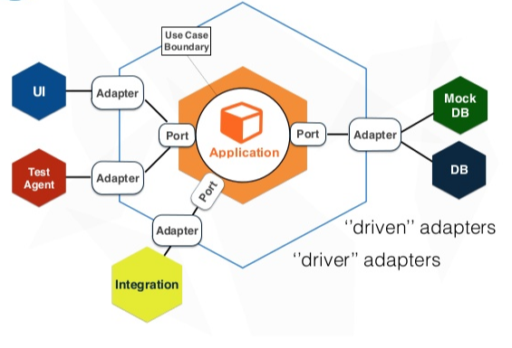
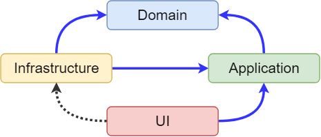
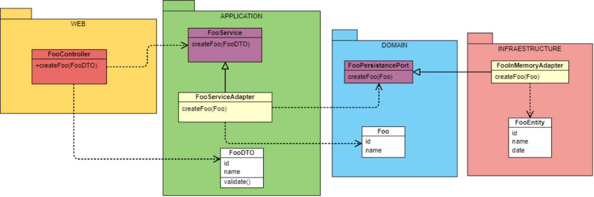
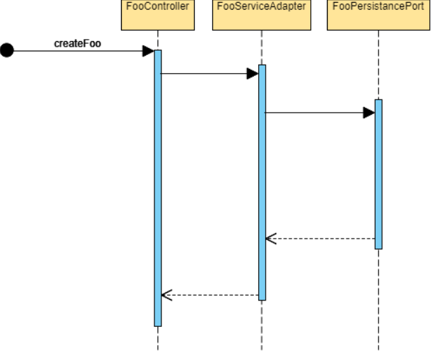

# TMANAGER-MODULE

La motivación de este proyecto es meramente personal, aunque creo que tiene bastantes usos tanto didácticos como profesionales. Basado en el framework SpringBoot para todo el backend y Vue para el frontend. El propósito es tener un ejemplo de una arquitectura limpia y preparada para poder empezar a desarrollar sin tener que lidiar con temas como la autenticación, manejo de excepciones, internacionalización etc. El proyecto está pensado para ser usado como microservicio y microfrontend, gracias a Vue, la aplicación web es una SPA que expone todo el js compilado (webpack) en una ruta accesible por una petición get, así pudiendo cargar el js del proyecto y pintarlo en un div en concreto de una aplicación mayor (ej: un dashboard).

- [TMANAGER-MODULE](#tmanager-module)
  - [Estructura del proyecto](#estructura-del-proyecto)
  - [Detalles de autenticación](#detalles-de-autenticaci%c3%b3n)
  - [Frontend](#frontend)
    - [Node](#node)
    - [Comandos NPM](#comandos-npm)
    - [El módulo](#el-m%c3%b3dulo)
  - [Backend](#backend)
    - [Logging](#logging)
    - [Locale](#locale)
    - [Gestión de excepciones](#gesti%c3%b3n-de-excepciones)
      - [Timeout](#timeout)
      - [Validaciones](#validaciones)
    - [Seguridad](#seguridad)
      - [Spring](#spring)
      - [Datos de keystore](#datos-de-keystore)
      - [A tener en cuenta con OAUTH2](#a-tener-en-cuenta-con-oauth2)
    - [CORS](#cors)
  - [Swagger](#swagger)
  - [Compilación](#compilaci%c3%b3n)

## Estructura del proyecto

La Arquitectura Hexagonal, dada a conocer por Alistair Cockburn — y también conocida como arquitectura de puertos y adaptadores — , tiene como principal motivación separar nuestra aplicación en distintas capas o regiones con su propia responsabilidad. De esta manera consigue desacoplar capas de nuestra aplicación permitiendo que evolucionen de manera aislada. Además, tener el sistema separado por responsabilidades nos facilitará la reutilización.

Gracias a este desacoplamiento obtenemos también la ventaja de poder testear estas capas sin que intervengan otras externas, falseando el comportamiento con dobles de pruebas, por ejemplo.
Esta arquitectura se suele representar con forma de hexágono, pero el número de lados no es lo que importa, sino lo que estos representan. Cada lado representa un puerto hacia dentro o fuera de la aplicación. Por ejemplo, un puerto puede ser el HTTP, y hacer peticiones a nuestra aplicación, otro puerto puede ser el SOAP y también hace peticiones a la aplicación. Otro puede ser un servidor de base de datos en donde persistir los datos de nuestro dominio.

La Arquitectura Hexagonal propone que nuestro dominio sea el núcleo de las capas y que este no se acople a nada externo. En lugar de hacer uso explícito y mediante el principio de inversión de dependencias nos acoplamos a contratos (interfaces o puertos) y no a implementaciones concretas.

A grandes rasgos, y si mucho detalle, lo que propone es que nuestro núcleo sea visto como una API con unos contratos bien especificados. Definiendo puertos o puntos de entrada e interfaces (adaptadores) para que otros módulos (UI, BBDD, Test) puedan implementarlas y comunicarse con la capa de negocio sin que ésta deba saber el origen de la conexión.
Esto es lo llamado puertos y adaptadores, que podrían ser definidos de la siguiente manera:
Puerto: definición de una interfaz pública.
Adapter: especialización de un puerto para un contexto concreto.

Fuente: <https://medium.com/@edusalguero/arquitectura-hexagonal-59834bb44b7f>



El proyecto se define por diferentes submodulos de Maven:

- **Loader:**
Es el encargado de cargar la aplicación, solo contiene la clase que arranca la aplicación de SpringBoot, los yml de variables de entorno por perfil y las configuraciones de los adaptadores de los puertos. Para esto último se usan las clases de configuración FooApplicationConfiguration y FooInMemoryAdapterConfiguration o FooMongoAdapterConfiguration dependiendo del perfil con el que se lance la aplicación (por defecto "develop-in-memory"). Para gestionar el tema de los perfiles (tanto el de Maven como el Spring) hay que mirar el pom.xml del módulo padre, donde se definen los perfiles de Maven y lo asocian al perfil Spring seteando los parámetros spring.profiles.active (usado para seleccionar el yml adecuado al perfil) y npm.build (usado en el proyecto frontend para compilar). Antes de seleccionar el el fichero según el perfil, se carga el application.yml que a su vez coge el valor de spring.profile.active y se lo setea a Spring, así pudiendo coger el fichero correspondiente al perfil (application-develop-in-memory por defecto).

- **Web:**
El submódulo Web es el encargado de copiar en su carpeta resources el proyecto del Frontend y a también de definir todas las politicas de seguridad, beans, traducciones, controladores (API) etc. Se puede decir que es el módulo más complejo de todos. Gracias a Springboot y sus dependencias el proyecto web está configurado para coger lo que tenga en resources, pero en este caso, antes de mostrar el index.html ubicado en la carpeta public (junto con el js y css compilado del Frontend) se tiene que realizar el logueo con el servidor OAuth. Para ello se define en el MainController.java que cuando vayamos al classpath "/" redireccionemos a "auth/authorize" en vez de enseñar el index (implementaciones en AuthController.java); para realizar esta acción se usan los certificados ubicados en la carpeta "publicKey", toda la configuración relacionada con OAuth está en el OAuth2ResourceServerConfigJwt.java. Una vez nos logueamos de forma satisfactoria, la ruta de redirección definida por el cliente de OAuth será la de "/init" que ese nos mostrará el index.html y ejecutará el js compilado (module.js) cuando se cargue.

- **Frontend (UI):**
Se trata de un proyecto muy simple de maven con todo lo necesario para ejecutar una aplicación de Vue, aquí se ubican (además de las carpetas de ficheros .js y .vue) el package.json (donde se definen los comandos que se pueden ejecutar), los ficheros de configuración .env.development y env.production (desde el comando de package.json se define el entorno a utilizar y dependiendo de esa variable se coge un fichero u otro) donde se definen algunos parámetros según el entorno, el vue.config.js (donde se define el proxy para desarrollo en local, evitar el hashing, el path del proyecto y que genere un solo .js con todo lo necesario para ser utilizado como microfrontend) y el pom.xml (donde en la fase de build se ejecuta el plugin frontend-maven-plugin para ejecutar comandos de node y npm, en caso de no tener estos instalados, los descarga, y por último se lanza el comando adecuado npm.build al perfil que se usa, definido en el pom.xml del proyecto raíz.).

- **Application:**
Donde se define toda la lógica del flujo de cada caso de uso, usa los adaptadores de entrada (implementados por la capa web) para ejecutar el flujo adecuado del caso de uso independientemente de las adaptaciones de los puertos, manteniendo la lógica de negocio limpia de dependencias innecesarias.

- **Domain:**
El encargado de almacenar los modelos que la capa de aplicación usa, independientemente del motor de bbdd que se use, este no depende de ninguna tecnología.

- **Infrastrucure:**
Es quien implementa los puertos de salida expuestos por la capa de aplicación, en este caso están los de persistencia en memoria y en MongoDB.

La idea de las capas arriba descritas es la siguiente.



Un ejemplo de diagrama de clases y flujo sería el siguiente (un caso de uso de crear Foo). Se pueden observar las diferentes interacciones de las capas con los puertos y adaptadores y los objetos que cada uno utiliza para realizar su labor.





## Detalles de autenticación

Credenciales de login para usuarios open-source son los siguientes.

``` javascript
user : user-open-source
password : password-open-source
```

## Frontend

La parte visual de la aplicación se ha desarrollado con Vue gracias a la facilidad y rapidez del framework a la hora de desarollar.

### Node

La versión de node que se instala para el clean install es v10.16.0, la versión de npm no hace falta definirla

### Comandos NPM

``` javascript
npm install
npm run serve
npm run build
npm run lint
```

Las fuentes del proyecto son de <http://materialdesignicons.com/>

### El módulo

El módulo launcher setea window.t_manager_access_token con su token de acceso y window.t_manager_access_token_validity con el tiempo de validez de este.

Si es un módulo nuevo y está incluido en el launcher, también hay que añadir que el módulo está ensamblado en el launcher con el objeto window.isModuleEnsambled con module:valor => {'t-manager-MODULE': true} para que luego el modulo pueda verificar si está o no incluido para asi llamar al servicio de recuperar el token por su cuenta o cogerlo de window.t_manager_access_token.

En el index.html tiene que existir un div con el id de store.state.module, osea el nombre del módulo que decidamos.

El main.js es el encargado de cargar e inicializar el frontend, en él se usa la librería común t-manager-commons para instalar componentes Vue, inicializar el refresco de token de oauth2 y la clase de Vuetify con los estilos del commons. Hace falta definir window.Vue = WindowVue y volver a ponerlo a nulo porque la libreria común del t-manager-commons es una libreria de Vue que espera que window.Vue esté seteado, pero luego los componentes se instalan en la instancia de Vue que se va a utilizar en este modulo; ya que al poder ir embebido en otra aplicación esto se tiene que diferenciar. Las traducciones que usa la aplicación, se añaden a las ya existentes en la librería, en caso de no existir el idioma, los componentes de esta no se verán con las etiquetas traducidas.

Los js router y store verifican que si la dependencia que van a usar esta ya en el objeto de Vue, no se use, esto también es para prevenir errores de plugins cargados más de una vez.

Las imagenes hay que cargarlas como se hace en el ejemplo porque en el momento en que la aplicación sea embebida, no hay otra forma de acceder a ellas.

## Backend

Como ya se ha explicado antes, el backend sigue una estructura hexagonal, los siguientes apartados explican como se han desarrollado las partes "conflictivas" o las que hay que entender bien de la aplicación.

### Logging

Gracias a la anotación @EnableWebSecurity(debug = true), el proyecto escupe todos los parámetros necesarios de las peticiones recibidas por consola. Springboot por defecto trae una configuración de logging que puede sobreescribirse, eso se hace mediante el fichero logback.xml, pero en este caso, para evitar más ficheros de configuración, se usa el logback-spring.xml donde además podemos usar otras anotaciones de Spring (como por ejemplo el del perfil) para tener diferentes configuraciones según el perfil elegido.

### Locale

En la clase WebMvcConfigurer se define el locale resolver, que en cada petición que recibe busca la cabecera "Accept-language" para definir el locale en el que tiene que mostrar los mensajes. Esta cabecera se setea gracias a un interceptor de Axios en el main.js del frontend.

### Gestión de excepciones

Las excepciones se recogen en CustomExceptionHandler, aquí es donde se transforman a CustomException para que el frontend reciba siempre los mismos campos independientemente del tipo de error.

#### Timeout

El timeout está gestionado con el filtro TimeoutFilter en el proyecto web, este corta el hilo según el valor definido de "module.timeoutValue" en el application.yml (5000ms por defecto).

#### Validaciones

Las rutas y objetos que se reciben en las peticiones se validacion con la anotación @Valid y en caso de no pasarla, el CustomExceptionHandler lo detecta, para un ejemplo ver el caso de createFoo en el proyecto web, donde recibe un objeto CreateFooWeb y el valor name es obligatorio, a su vez, se le dice la etiqueta a mostrar en el locale adecuado. Es una capa más de validación, ya que el frontend tambien valida esto.

### Seguridad

Toda la gestión de la seguridad se lleva a cabo gracias a Spring security y la aplicación t-manager-oauth2-server ubicada en la nube.

#### Spring

Solo se securizan las rutas que contengan "/api/*" o "/api/**", todo lo demás es público, esto se debe a que la aplicación (en el frontend) usa el modo history, evitando así tener que usar los # en el path, por lo que si se quiere acceder por ejemplo a la ruta /home, esta no puede estar securizada; además, todas las peticiones que no sean de api, ni de swagger, ni de recursos, se redirigen al index.html, para así poder copiar y pegar rutas en el navegador y no tener problema.

#### Datos de keystore

La aplicación t-manager-oauth2-server usa de un certificado para que sus consumidores puedan confiar de donde vienen las peticiones.

``` javascript
keystore name: t-manager
keypass: t-manager-password
store pass: t-manager-password
```

#### A tener en cuenta con OAUTH2

El resourceId dado de alta en users de mongo tiene que tener el mismo que la aplicacion module en OAuth2ResourceServerConfigJwt -> config.resourceId("foo");. Al acceder al path del proyecto en <http://localhost:8002/module,> se redirige a la página de login de la aplicación t-manager-oauth2-server donde después de introducir las credenciales se vuelve a redirigir a <http://localhost:8002/module/init> que a su vez lo hace a <http://localhost:8002/module/home.> Para la autenticación y posterior autorización, se usa el flujo de código de oauth2 (<https://www.oauth.com/oauth2-servers/access-tokens/authorization-code-request/).> El frontend se ocupa de refrescar el token automaticatimante al hacer uso de la utilidades de la librería común t-manager-commons (esto sucede en el main.js de la capa frontend y al igual que el locale, se envia en todas las peticiones a api como cabecera Authorization).

### CORS

Al tratarse de una SPA con intención de ser usada como microservicio y microfrontend, el CORS debe permitir absolutamente todo, ya que en caso de que un usuario no identificado quiera acceder a un recurso del api no podrá por no tener el token de autenticación.

## Swagger

El swagger está montado para soportar Oauth2, por lo que en caso de querer llamar al API hay que loguearse en el icono de candado y luego añadir los parametros necesarios a la petición, su configuración se encuentra en SwaggerConfiguration.java (en el proyecto Web).

``` javascript
http://localhost:8002/module/swagger-ui.html
```

## Compilación

Los perfiles de compilado y ejecución de la aplicación son los siguientes:

- **develop-in-memory** (adaptadores en memoria en local)
- **develop-mongo** (adaptadores en mongo en local)
- **production-in-memory** (adaptadores en memoria en producción)
- **production-mongo** (adaptadores en mongo en producción)
  
Para compilar este proyecto hay que situarse en el proyecto raíz y ejecutar el siguiente comando, por defecto el perfil que se usa es el "develop-in-memory" pero existen otros 3 (explicados anteriormente):

``` bash
mvn clean install -Pproduction-in-memory
```

Para ejecutar este proyecto hay que situarse en el proyecto loader y ejecutar:

``` bash
mvn spring-boot:run -Dspring.profiles.active=production-in-memory
```
